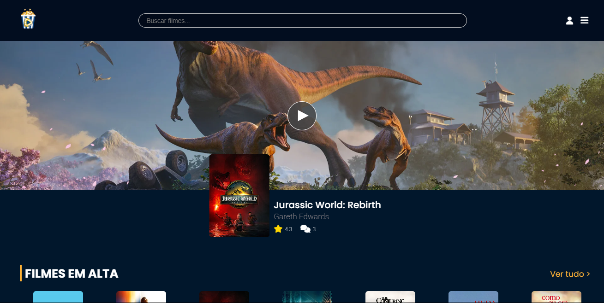

# Projeto de Programação para Web 1 - PipocaFlix

## 
🎬 Pipocaflix
 
  
Projeto pessoal inspirado em plataformas como Letterboxd, Last.fm e IMDb, com o objetivo de integrar funcionalidades de rastreamento, avaliação e catálogo de filmes, séries e artistas favoritos — tudo como forma de estudo e prática de desenvolvimento.

## 🚀 Tecnologias Utilizadas

## 📝 Sobre o Projeto

PipocaFlix é uma aplicação web inspirada em plataformas como Letterboxd e IMDb, criada como um projeto de estudo para a disciplina de Programação para Web 1. O objetivo é oferecer um espaço onde os usuários podem interagir com um vasto catálogo de filmes e séries, registrar suas opiniões e acompanhar o que estão assistindo.

Este projeto foi uma oportunidade para aplicar e aprofundar conhecimentos em:

- Estruturação de projetos web com Flask e Blueprints.
- Modelagem de banco de dados relacional com SQLAlchemy.
- Desenvolvimento de interfaces dinâmicas com Jinja2 e JavaScript.
- Implementação de um sistema completo de autenticação de usuários.

## 📚 Funcionalidades

### Para Usuários

- Autenticação Segura: Sistema completo de cadastro, login, logout e recuperação de senha.
- Perfil Personalizado: Cada usuário tem uma página de perfil onde pode editar suas informações e visualizar sua atividade na plataforma.
- Avaliações e Comentários: Dê notas de 1 a 5 estrelas e compartilhe suas opiniões sobre filmes e séries.
- Listas e Favoritos: Adicione filmes e atores à sua lista de favoritos e acompanhe o que você está assistindo.
- Descoberta de Conteúdo: Explore o catálogo com filtros por gênero, ano de lançamento e ordenação por popularidade ou avaliação.
- Busca Inteligente: Encontre filmes rapidamente com um sistema de busca que oferece sugestões em tempo real.

### Para Administradores

- Painel de Controle: Uma área restrita para gerenciar todo o conteúdo da plataforma.
- Cadastro de Conteúdo: Adicione e edite filmes, séries, episódios, atores e gêneros.
- Visualização de Logs: Monitore as atividades do sistema, como logins, erros e acessos não autorizados.

## 🎯 Principais Desafios e Aprendizados

Este projeto foi concebido para solidificar conhecimentos em áreas-chave do desenvolvimento web, enfrentando os seguintes desafios:

- Backend Robusto: Construir toda a lógica de servidor, incluindo autenticação de usuários e manipulação de dados de forma segura e eficiente.
- Modelagem de Dados: Estruturar um banco de dados relacional que suportasse as interações entre usuários, filmes, atores e avaliações.
- Interface Dinâmica: Desenvolver um frontend que consumisse e exibisse os dados do backend de maneira intuitiva e agradável para o usuário.

## Integrantes do Grupo

* Andrew Sander Felix de Aragão Pinheiro
* Luca Lopes Marques
* Mariana Farias de Brito
* Ryan Monteiro Gomes

